# 实例管理

## 基本操作

### 启动MongoDB实例

如果要启动处于关闭状态的MongoDB实例，首先选择需要启动的MongoDB实例，在右侧操作项中，点击“启动”按钮，弹出的确认对话框选择确定，即可启动MongoDB实例。

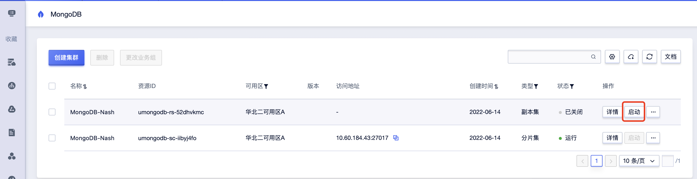

### 重启MongoDB实例

进入产品主页， 在列表中找到对应的实例， 点击“操作”栏下的扩展按钮， 点击“重启”

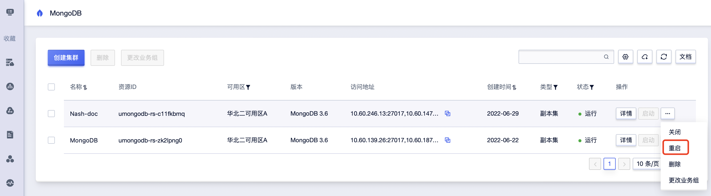

### 关闭MongoDB实例

进入产品主页， 在列表中找到对应的实例， 点击“操作”栏下的扩展按钮， 点击“关闭”

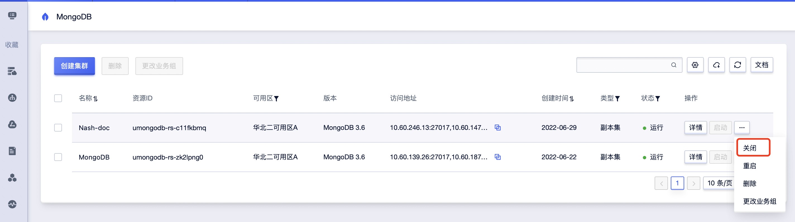

### 删除MongoDB实例

#### 单个删除
进入产品主页， 在列表中找到对应的实例， 点击“操作”栏下的扩展按钮， 点击“删除”

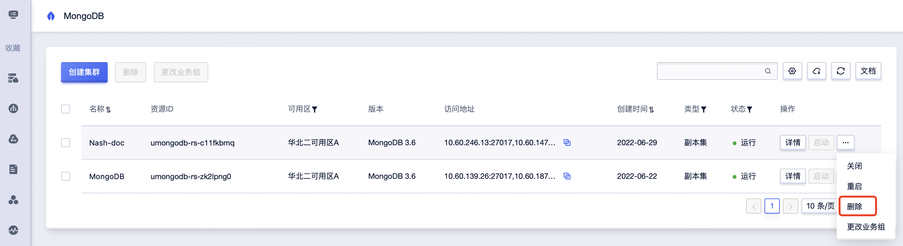

#### 批量删除

进入产品主页， 在列表中选择多个实例， 点击批量操作栏中的“删除”

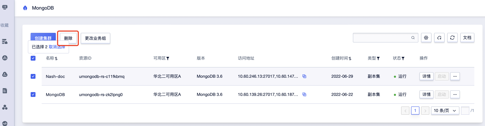

### 修改备注及名称

进入产品主页， 在列表中找到对应的实例， 点击“名称”栏下的“修改名称及备注”, 弹出“修改名称备注”窗口, 修改完成, 确定即可。

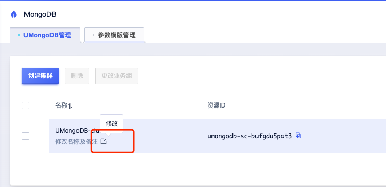

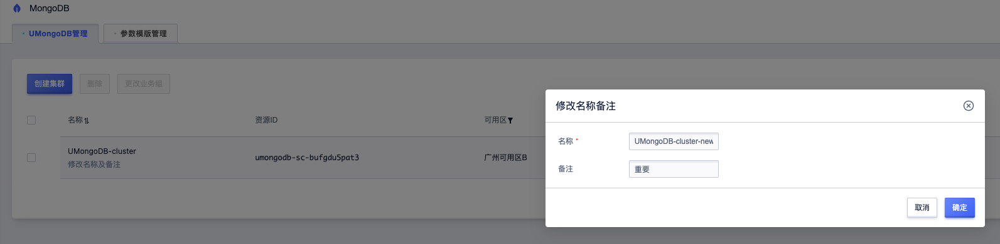

### 重置密码

进入产品主页， 在列表中找到对应的实例， 点击“操作”栏下的扩展按钮， 点击“重置密码”

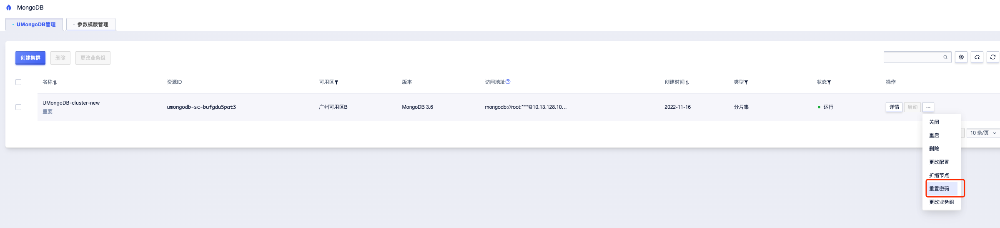

出现“重置数据库密码”弹窗, 填入新的密码, 点击确定, 即可完成重置密码操作。

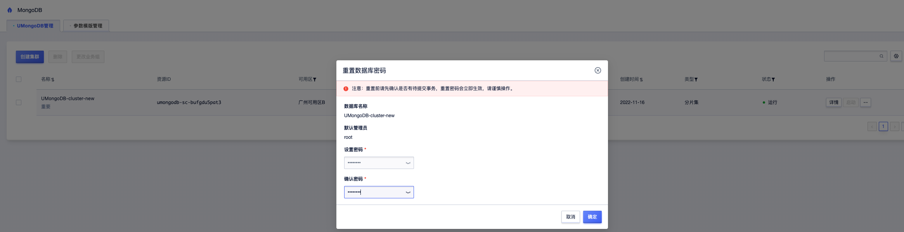

## 详情页

进入产品主页， 在列表中找到对应的实例， 点击“操作”栏下的”详情“按钮

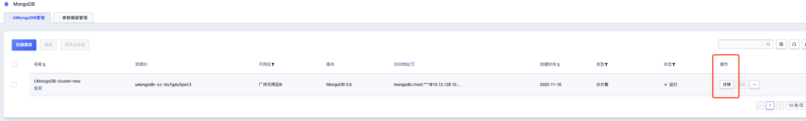

详情页中可以看到当前集群的各项信息, 如: 基本信息、配置信息、付费信息、节点相关信息、监控信息等,
同时详情页也支持 ”关闭“, ”重启“, ”删除“, ”重置密码“ 等操作

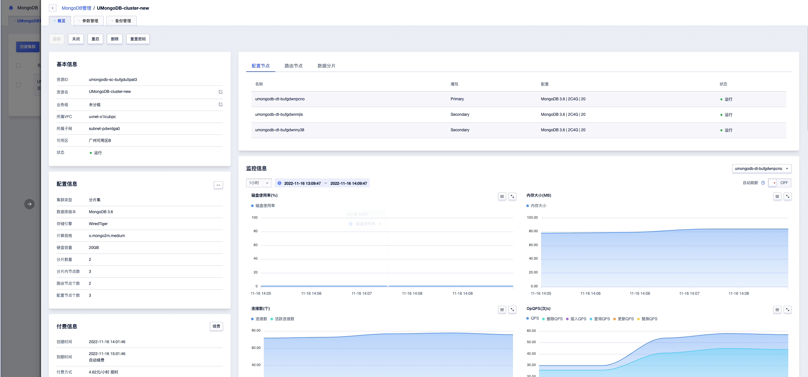

## 更改配置

进入产品主页， 在列表中找到对应的实例， 点击“操作”栏下的扩展按钮， 点击“更改配置”

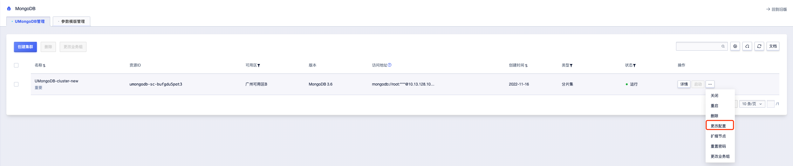

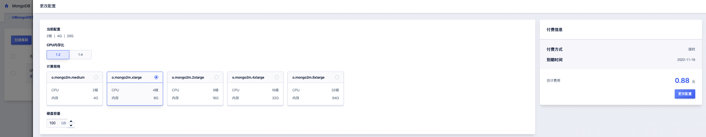

调整到目标 CPU规格, 磁盘容量后, 点击 “更改配置”, 完成支付后, 集群将进入“升降级中” 状态。

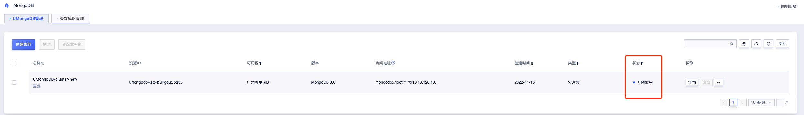

一段时间后, 集群将恢复到更改配置之前的状态, 完成配置调整。

注意：
    1. 更改配置过程中, 集群中各个需升降级的节点会依次会完成配置调整, 期间该节点数据库服务会发生关闭和启动。
    2. 由于升降级期间部分节点会不可用(此时集群整体仍处于可用状态), 所以请在业务低峰期执行升降级操作。
    3. 集群 “升降级中” 期间, 集群不可执行 重启、关闭、删除等操作, 也请避免

## 扩缩节点

进入产品主页， 在列表中找到对应的实例， 点击“操作”栏下的扩展按钮， 点击“扩缩节点”

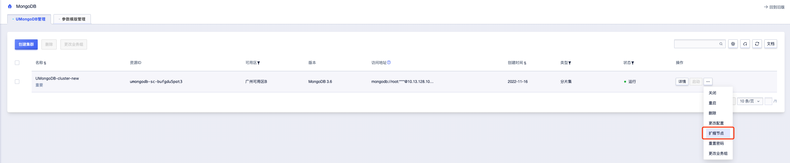

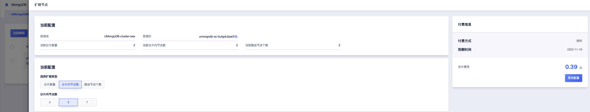

对于分片集支持调整 “分片数量”, “分片内节点数”, “路由节点数”, 对于副本集只支持调整 “节点个数”。

考虑到集群的稳定性, 目前一次只能调整一种属性, 比如选择了调整 “分片内节点数”, 就不能同时调整其他属性。

调整对应属性数量后, 点击 “更改配置”, 完成支付后, 集群将进入“升降级中” 状态。

一段时间后, 集群将恢复到运行状态, 完成扩缩节点。

