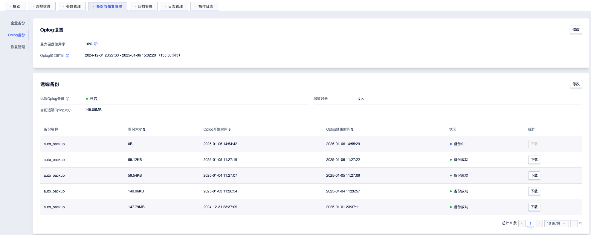

# Oplog 备份

### 操作场景

MongoDB 除了集群的全量备份以外，还支持单独对Oplog备份。对于回档功能有更高要求(如更大的回档时间范围)的集群，可以选择开通Oplog备份。

### 功能限制

* 目前仅副本集支持此功能
* Oplog备份会根据备份文件的大小进行收费

### 操作步骤

**Oplog设置**

进入集群的`备份与恢复管理`界面，选择`Oplog备份`，可以修改**本地Oplog**的最大磁盘使用率，以及查看**本地Oplog**窗口时间。

备注:

- 当前仅3.6及以上版本支持修改**本地Oplog**的最大磁盘使用率
- 修改**本地Oplog**的最大磁盘使用率集群会发生重启，建议选择业务低峰期操作

**开启Oplog备份功能**

进入集群的`备份与恢复管理`界面，选择`Oplog备份`，点击`远端备份`右侧`修改`按钮。

在`修改远端备份策略`弹窗中，开启远端Oplog备份，并设置合适的保留时长。点击确定即可开启Oplog备份。

**查看备份信息**

开启Oplog备份后，即可看到备份策略和备份列表。

已备份成功的备份，点击右侧`下载`按钮，可以将备份下载到本地。

**关闭Oplog备份功能**

进入集群的`备份与恢复管理`界面，选择`Oplog备份`，点击`远端备份`右侧`修改`按钮。
在`修改远端备份策略`弹窗中，关闭远端Oplog备份。点击确定即可关闭Oplog备份。

备注：

- 若关闭远端Oplog备份，则已备份的文件将会全部删除，请谨慎操作。

**更详细计费项请参考**

https://docs.ucloud.cn/mongodb_nvme/price/bill
