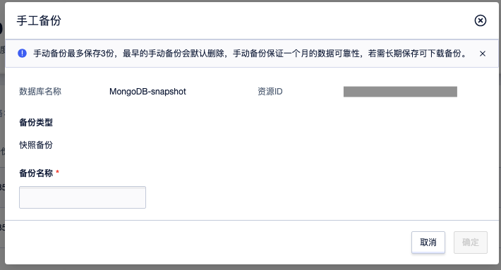

# 快照备份

### 操作场景

MongoDB 除了逻辑备份以外，还支持快照备份。快照备份对集群影响小、速度快，对于某些数据量较大、备份时间过长的情况，可以考虑开通快照备份。

### 功能限制

* 开通快照备份服务后，不支持修改备份方式。
* 产生的快照备份不支持下载。
* 快照备份会根据备份文件的大小进行收费。

### 操作步骤

**开启快照备份功能**
进入集群的`备份与恢复管理`界面，点击立即开通。

**获取快照自动备份策略**
进入集群的`备份与恢复管理`界面，获取自动备份策略。

**获取快照备份列表**
进入集群的`备份与恢复管理`界面，获取自动备份以及手动备份的备份列表。

**获取快照备份容量**
进入集群的`备份与恢复管理`界面，已经开通快照备份的会显示备份使用量。

**手动备份**
进入集群的`备份与恢复管理`界面，选择手动备份，进行手动快照备份。

更详细计费项请参考
https://docs.ucloud.cn/mongodb_nvme/price/bill
